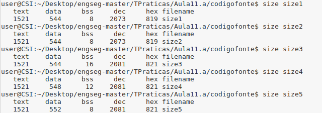
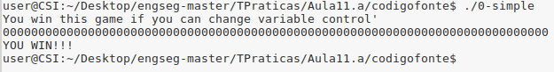
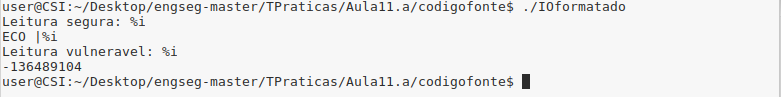
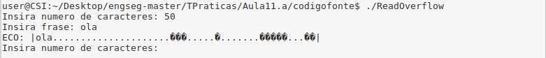
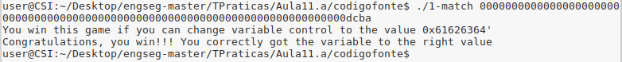

# TP - 29/Abr/2019

## 1. Buffer Overflow

### Experiência 1.1
Em relação ao segmento de dados, verifica-se que o *size4* possui mais 4 bytes em relação ao *size1* e o *size5* mais 4 bytes em relação ao *size4*. Isto deve-se ao facto de no *size4* existe uma variável static int inicializada, que corresponde a mais 4 bytes de data. No *size5* a variável global int também inicializada, correspondendo a um acréscimo de 4 bytes no segmento data.

No segmento de text, as instruções são as mesmas em todos os programas, logo os valores são os esperados.

No segmento de bss, as diferenças entre *size1*, *size2* e *size3* não são as esperdas, pois era de esperar que no *size2* o bss tivesse alocado mais 4 bytes relativamente ao *size1* e no *size3* mais 4 bytes que o bss do *size2*. No entanto, estes factos podem ser otimizações feitas pelo compilador.

### Experiência 1.3
No caso do programa em *C++*, este entra em loop pois não são verificados os limites do array. Quando o programa escreve fora do limite do array, está a escrever na variável i, fazendo com que esta seja mudada para o valor 7.

No caso dos programas em *Java* e *Python*, os programas terminam com uma exceção porque se tenta aceder a um índice inválido do array.

### Pergunta 1.1
Os programas *Java* e *Python* terminam com um erro se introduzir um número de elementos superior ao tamanho com que o array foi inicializado (10).

No caso do programa em *C++*, 

### Pergunta 1.2
Nos programas *Java* e *Python*, se o número de valores a guardar no array for igual ou inferior ao tamanho do array, o programa corre sem problemas. Caso se pretenda guardar mais elementos no array do que o tamanho do mesmo, o programa termina com uma exceção.

No programa *C++*, se o número de valores a guardar no array for igual ou inferior ao tamanho do array, o programa corre sem problemas. Caso seja inserido um valor entre 10 e 19, o programa entra em loop, porque quando o valor de *i* ultrapassa o tamanho máximo do array, então ele escreverá na posição da variável *i*, continuando a escrever dentro dos limites do array.
Caso o valor seja superior a 19, o programa tem dois comportamentos:
- Por vezes, termina em segmentation fault, isto porque se escreveu no endereço de retorno;
- Outra vezes, caso sejam pedidos resultados que estivesse num indice inferior ou igual a 9, o resultado estaria certo mas caso fosse superior, a resposta conteria valores errados dado que o ciclo terminou antes destes valores serem calculados.

### Pergunta 1.3
No ficheiro *RootExploit.c* a vulnerabilidade de buffer overflow existe porque a função gets não valida o tamanho do input. Logo é possível escrever na variável *pass* caso seja inserido um input com tamanho superior a 4 e assim, dando a mensagem "Foram-lhe atribuidas permissões de root/admin". 

No ficheiro *0-simple.c* a vulnerabilidade que existe é a mesma que no ficheiro anterior. No entanto para ser explorada é necessário que o input seja maior por uma unidade do que o tamanho do buffer. Isto porque é preciso que seja escrito na atribuição da variável *control*. No entanto, existe casos em que não foi possível conseguir a mensagem "YOU WIN" devido ao alinhamento de memória forçado pelo compilador. 

### Experiência 1.5
Na função segura, o output da função printf é formatado pela string *%s* sendo que qualquer sequência de formatação no input ("%s", "%d", "%i, etc) vai ser lida de forma literal.

Na função vulnerável, a string passada à função *printf* é diretamente aquela que é lida e caso esta contenha alguma sequência de formatação, esta vai ser substituída por um valor indeterminado, como podemos observar na figura seguinte.

### Pergunta 1.4
No programa *ReadOverflow.c* podemos observar que a leitura das strings está protegida por invocações da função *fgets*, o número de bytes no output é apenas limitado pelo número dado como resposta à primeira pergunta do programa. Assim, é possível obter o conteúdo de outras posições da memória. 

### Pergunta 1.5
Para conseguir a mensagem 'Congratulations, you win!!!', o programa foi testado em tentativa erro para determinar quantos bytes tem de ter o input para começar a alterar o valor da variável. De seguida, dado que se pretende obter o valor 0x61626364, ou seja abcd em *ASCII*, temos de inserir uma string qualquer de 78 bytes como input, concatenada com a string dcba, devido à disposição em little-endian. Podemos observar na figura seguinte um exemplo:

### Experiência 1.8

### Experiência 1.9

