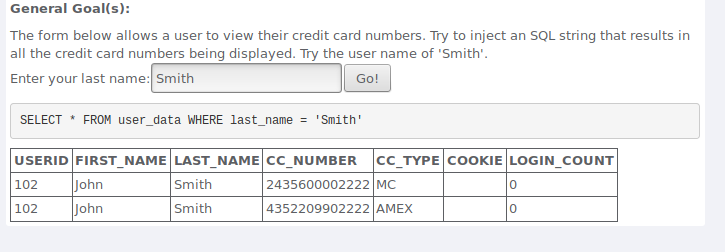
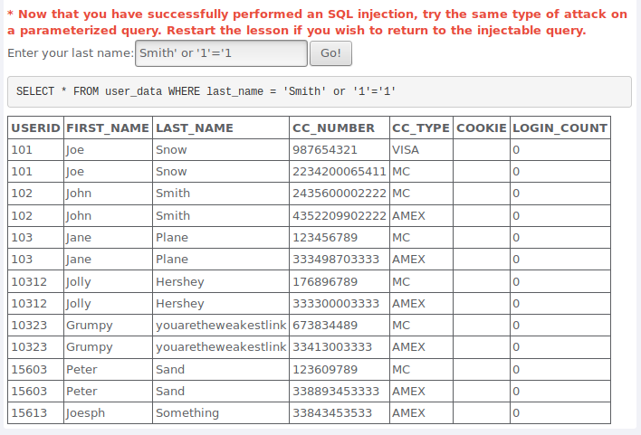
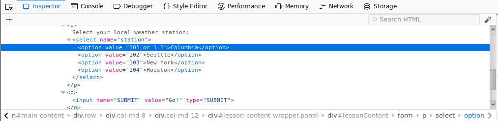
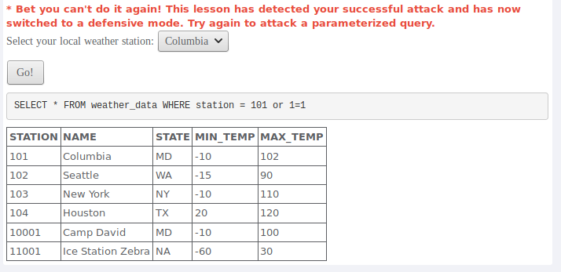
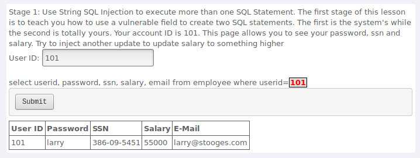
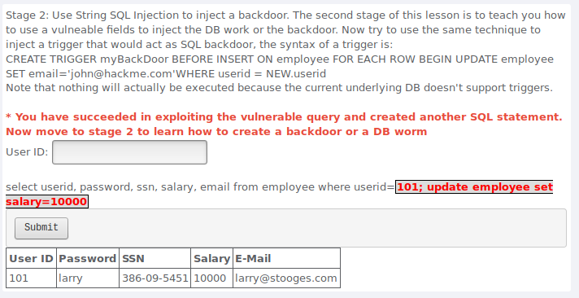
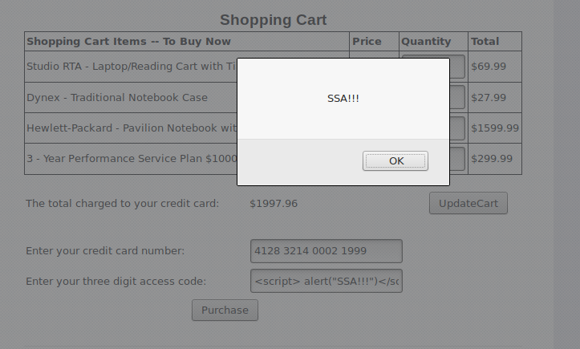
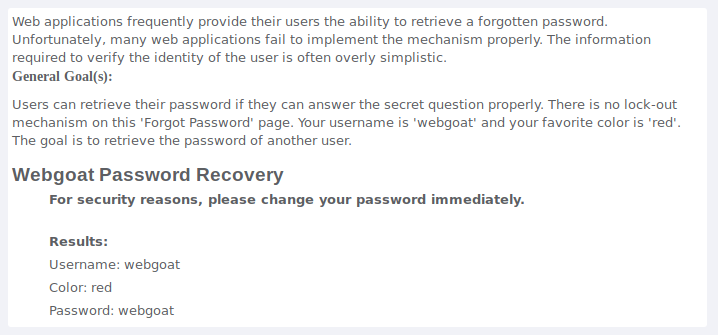
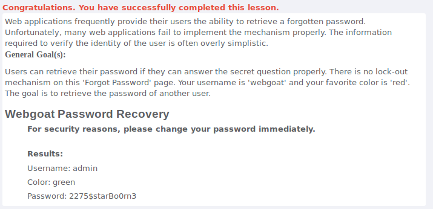

# Aula TP - 06/Mai/2019

## 1. Injection
### Pergunta 1.1 - String SQL Injection

 

### Pergunta 1.2 - Numeric SQL Injection

 

### Pergunta 1.3 - Database Backdoors

 

## 2. XSS
### Pergunta 2.1 - Reflected XSS

## 3. Quebra na Autenticação
### Pergunta 3.1 - Forgot Password

 

