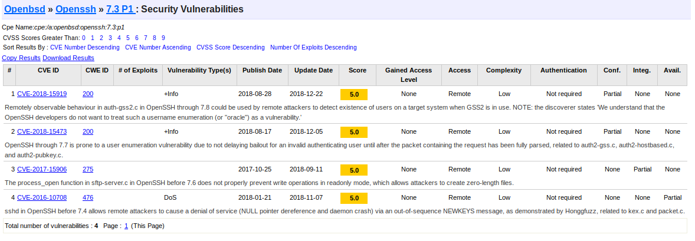
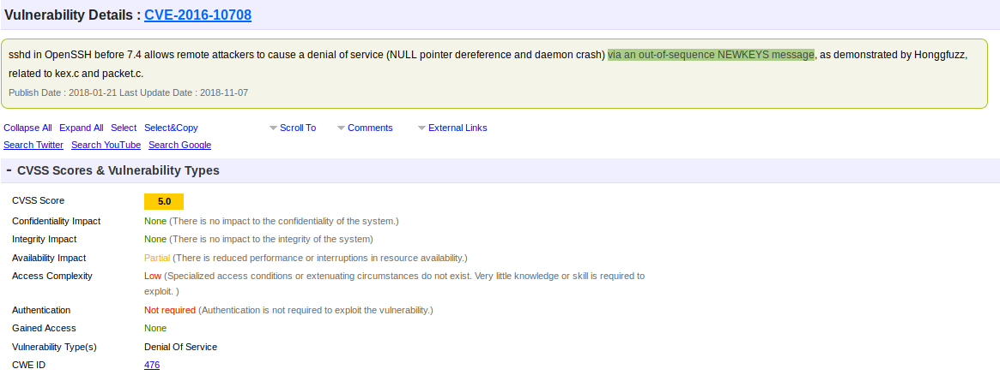

# TP - 18/Fev/2018

## 1-Assinaturas cegas (Blind signatures) baseadas no Elliptic Curve Discrete Logarithm Problem (ECDLP)

### Pergunta 1.1
Nesta pergunta pretende-se alterar o código fornecido para a experiência 1.2, de forma a simplificar o input e output.

##### - Assinante:

* `init-app.py`
É pretendido que este ficheiro retorne o **R'** utilizado no processo, que corresponde ao ponto da curva aleatoriamente escolhido para cada request. 

* `init-app.py -init`
Também é pretendido que através da execução de `python init-app.py -init` os componentes _initComponents_ e _pRDashComponents_ sejam calculados e guardados num ficheiro **sig.settings**.
Sendo assim, o utilizador primeiramente tem de correr o comando: `python init-app.py -init` para que o estado interno seja criado com o _initComponents_ e _pRDashComponents_ (R'). De seguida, deve correr o comando: `python init-app.py` e este irá ler do ficheiro **sig.settings** o componente R' e irá imprimi-lo no ecrã.
```python
import sys
from eVotUM.Cripto import eccblind

settings_file = "./sig.settings"
initComponents = ""
pRDashComponents = ""

def printUsage():
    print("Usage: python init-app.py")

def init():
    initComponents, pRDashComponents = eccblind.initSigner()
    f = open(settings_file, "w")
    f.write(initComponents + "\n" + pRDashComponents) # Guarda as componentes no ficheiro settings

def load_settings():
    f = open(settings_file, "r")
    initComponents = f.readline()
    pRDashComponents = f.readline()
    return initComponents, pRDashComponents

def parseArgs():
    if len(sys.argv) == 1: # Programa inicializado sem a opção -init
        initComponents,pRDashComponents = load_settings()
        print("pRDashComponents: %s" % pRDashComponents)
    elif sys.argv[1] == "-init": # Quando inicializado com o -init
        init()
    else:
        printUsage()

if __name__ == "__main__":
    parseArgs()
```
* `blindSignature-app.py -key <chave privada> -bmsg <Blind message>`
Este ficheiro é o que contém o código necessário para realizar a assinatura cega. É pretendido que sejam adicionadas as opções `-key <chave_privada>`, que permitirá o uso de um ficheiro com a chave privada do assinante e `-bmsg blind-message`, que corresponderá à mensagem que se pretende assinar. Deverá retornar ao utilizador a _BlindSignature_(s).
```python
from eVotUM.Cripto import utils
import sys
from eVotUM.Cripto import eccblind

settings_file = "./sig.settings"

def printUsage():
    print("Usage: python blindSignature-app.py -key <private-key.pem> -bmsg <Blind message>")

def load_settings():
    f = open(settings_file, "r")
    initComponents = f.readline()
    pRDashComponents = f.readline()
    return initComponents, pRDashComponents

def parseArgs():
    if len(sys.argv) == 5 and sys.argv[1] == "-key" and sys.argv[3] == "-bmsg":
        eccPrivateKeyPath = sys.argv[2] # Caminho para a chave privada
        msg = sys.argv[4] # Blind Message
        main(eccPrivateKeyPath, msg)
    else:
        printUsage()

def showResults(errorCode, blindSignature):
    print("Output")
    if (errorCode is None):
        print("Blind signature: %s" % blindSignature)
    elif (errorCode == 1):
        print("Error: it was not possible to retrieve the private key")
    elif (errorCode == 2):
        print("Error: init components are invalid")
    elif (errorCode == 3):
        print("Error: invalid blind message format")

def main(eccPrivateKeyPath, blindM):
    initComponents, pRDashComponents = load_settings() # Carrega do ficheiro os componentes
    pemKey = utils.readFile(eccPrivateKeyPath)
    print("Input")
    passphrase = raw_input("Passphrase: ")
    errorCode, blindSignature = eccblind.generateBlindSignature(pemKey, passphrase, blindM, initComponents)
    showResults(errorCode, blindSignature) # Retorna a Blind Signature

if __name__ == "__main__":
    parseArgs()
```

##### - Requerente:

* `ofusca-app.py`
É o programa que gera a _Blind Message_ (m'), imprimindo-a no ecrã, e guarda as _BlindComponents_ e _pRComponentes_ num ficheiro do Requerente (**req.settings**). Este programa deverá aceitar como opções `-msg <MENSAGEM_ORIGINAL>` e `-RDash <pRDashComponents>` que são a mensagem a ofuscar e o **R'** que é o ponto aleatório da curva elítica selecionado na inicialização, respetivamente. Assim as alterações essenciais ao código foram:
```python
import sys
from eVotUM.Cripto import eccblind

settings_file = "./req.settings"

def printUsage():
    print("Usage: python ofusca-app.py -msg <mensagem a assinar> -RDash <pRDashComponents>")

def parseArgs():
    if len(sys.argv) == 5 and sys.argv[1] == "-msg" and sys.argv[3] == "-RDash":
        main(sys.argv[2], sys.argv[4])
    else:
        printUsage()

def showResults(errorCode, result):
    print("Output")
    if (errorCode is None):
        blindComponents, pRComponents, blindM = result
        print("Blind message: %s" % blindM) # Imprime a blind message no ecra
        f = open(settings_file, "w")
        f.write(blindComponents + "\n" + pRComponents) # Guarda num ficheiro as components
        f.close()
    elif (errorCode == 1):
        print("Error: pRDash components are invalid")

def main(data, pRDashComponents):
    errorCode, result = eccblind.blindData(pRDashComponents, data)
    showResults(errorCode, result)

if __name__ == "__main__":
    parseArgs()
```
* `desofusca-app.py`
É o programa que vai gerar a signature(s') através da _blind signature_ e do **R'**. Para isto deverá utilizar como opções `-s <BlindSignature>` e `-RDash <pRDashComponents>` que são a _BlindSignature_ retornada por `blindSignature-app.py` e o **R'** que é o ponto aleatório da curva elítica selecionado na inicialização.
```python
import sys
from eVotUM.Cripto import eccblind

settings_file = "./req.settings"

def printUsage():
    print("Usage: python desofusca-app.py -s <Blind Signature> -RDash <pRDashComponents>")

def load_settings():
    f = open(settings_file, "r")
    blindComponents = f.readline()
    pRComponents = f.readline()
    return blindComponents, pRComponents

def parseArgs():
    if len(sys.argv) == 5 and sys.argv[1] == "-s" and sys.argv[3] == "-RDash":
        main(sys.argv[2], sys.argv[4])
    else:
        printUsage()

def showResults(errorCode, signature):
    print("Output")
    if (errorCode is None):
        print("Signature: %s" % signature) # Imprime a assinatura
    elif (errorCode == 1):
        print("Error: pRDash components are invalid")
    elif (errorCode == 2):
        print("Error: blind components are invalid")
    elif (errorCode == 3):
        print("Error: invalid blind signature format")

def main(blindSignature, pRDashComponents):
    print("Input")
    blindComponents, pRComponents = load_settings() # Carrega do ficheiro do Requerente as components
    errorCode, signature = eccblind.unblindSignature(blindSignature, pRDashComponents, blindComponents)
    showResults(errorCode, signature)

if __name__ == "__main__":
    parseArgs()
```

##### - Verificador:

* `verify-app.py`
É o programa que vai validar se a assinatura obtida com `desofusca-app.py` é válida ou não. Para o efeito serão necessários comandos como: `-cert <certificado do assinante>`, `-msg <mensagem original a assinar>`, `-sDash <Signature>` e `-f <ficheiro do requerente>` que usam o certificado com a chave pública do **Assinante**, a mensagem do Requerente sem ser assinada, a assinatura devolvida pelo `desofusca-app.py` e o ficheiro das settings do requerente (**req.settings**), respetivamente.
```python
import sys
from eVotUM.Cripto import eccblind
from eVotUM.Cripto import utils

def printUsage():
    print("Usage: python verify-app.py -cert <certificado do assinante> -msg <mensagem original a assinar> -sDash <Signature> -f <ficheiro do requerente>")

def load_settings(settings_file):
    f = open(settings_file, "r")
    blindComponents = f.readline()
    pRComponents = f.readline()
    return blindComponents, pRComponents

def parseArgs():
    if len(sys.argv) == 9 and sys.argv[1] == "-cert" and sys.argv[3] == "-msg" and sys.argv[5] == "-sDash" and sys.argv[7] == "-f":
        eccPublicKeyPath = sys.argv[2]
        main(eccPublicKeyPath, sys.argv[4], sys.argv[6], sys.argv[8])
    else:
        printUsage()

def showResults(errorCode, validSignature):
    print("Output")
    if (errorCode is None):
        if (validSignature):
            print("Valid signature")
        else:
            print("Invalid signature")
    elif (errorCode == 1):
        print("Error: it was not possible to retrieve the public key")
    elif (errorCode == 2):
        print("Error: pR components are invalid")
    elif (errorCode == 3):
        print("Error: blind components are invalid")
    elif (errorCode == 4):
        print("Error: invalid signature format")

def main(eccPublicKeyPath, data, signature, req_file):
    pemPublicKey = utils.readFile(eccPublicKeyPath) # Leitura do certificado
    blindComponents, pRComponents = load_settings(req_file) # Leitura das componentes
    errorCode, validSignature = eccblind.verifySignature(pemPublicKey, signature, blindComponents, pRComponents, data)
    showResults(errorCode, validSignature)

if __name__ == "__main__":
    parseArgs()
```

## 2-Protocolo SSL/TLS

### Pergunta 2.1
* i) Nesta pergunta é pedido para efetuar o teste SSL Server test aos sites indicados (que têm de obrigatoriamente funcionar sobre HTTPS). No nosso caso, escolher três sites de Bancos a operar fora da Europa (i.e., sites com domínios não europeus). Os bancos escolhidos foram:

    - https://www.dbj.jp/en/ - Development Bank of Japan (Japão)

    - https://www.jfc.go.jp/ - Japan Finance Corporation (Japão)

    - https://www.bankofindia.co.in/ - Bank of India (Índia)

* ii) O resultado do SSL Server test relativo ao site escolhido com pior rating, é referente ao site *www.dbj.jp*. O rating geral é de nivel B, enquanto os outros dois sites é de nivel A. O nivel é mais baixo devido a não suportar forward secrecy (FS), isto é uma propriedade de protocolos de comunicação segura que protege chaves de sessão anteriores contra futuros danos de chave privada. 

* ii) **Ticketbleed (vulnerability)**
Esta vulnerabilidade é uma vulnerabilidade de software no TLS/SSL na stack das aplicações F5 BIG-IP, que permitem a um atacante remoto extrair até 31 bytes de memória não inicializada de cada vez. 
É uma vulnerabilidade parecida com a vulnerabilidade Heartbleed, mas expõe menos memória de cada vez e não afeta o OpenSSL, como o Heartbleed.
Esta vulnerabilidade encontra-se na implementação dos Session Tickets, que é uma técnica usada para acelerar ligações repetidas. Quando um cliente fornece uma ID de sessão, que pode conter entre 1 e 31 bytes de comprimento, junto com um ticket de sessão, o servidor deve repetir a ID da sessão para sinalizar a aceitação do ticket.
A stack F5 ecoa sempre de volta 32 bytes de memória, mesmo se a ID da sessão for menor. Então um atacante que fornece uma ID de sessão de 1 byte receberá 31 bytes de memória não inicializada, em que esta memória pode conter material importante ou dados confidenciais.

    
## 3-Protocolo SSH

### Pergunta 3.1
Nesta pergunta é pedido para utilizar o ssh-audit para efetuar teste aos sites indicados, que têm de obrigatoriamente ter o ssh (usualmente, na porta 22) ativo. No nosso caso, tivemos de escolher dois servidores ssh de empresas comerciais em San Francisco.

1.Anexe os resultados do ssh-audit à sua resposta.
A primeira empresa escolhida foi a Digital Ocean e a informação relativa a um dos seus servidores _ssh_ é a seguinte:
```
# general
(gen) banner: SSH-2.0-OpenSSH_7.3p1 Ubuntu-1
(gen) software: OpenSSH 7.3p1
(gen) compatibility: OpenSSH 7.3+, Dropbear SSH 2016.73+
(gen) compression: enabled (zlib@openssh.com)

# key exchange algorithms
(kex) curve25519-sha256@libssh.org          -- [info] available since OpenSSH 6.5, Dropbear SSH 2013.62
(kex) ecdh-sha2-nistp256                    -- [fail] using weak elliptic curves
                                            `- [info] available since OpenSSH 5.7, Dropbear SSH 2013.62
(kex) ecdh-sha2-nistp384                    -- [fail] using weak elliptic curves
                                            `- [info] available since OpenSSH 5.7, Dropbear SSH 2013.62
(kex) ecdh-sha2-nistp521                    -- [fail] using weak elliptic curves
                                            `- [info] available since OpenSSH 5.7, Dropbear SSH 2013.62
(kex) diffie-hellman-group-exchange-sha256  -- [warn] using custom size modulus (possibly weak)
                                            `- [info] available since OpenSSH 4.4
(kex) diffie-hellman-group16-sha512         -- [info] available since OpenSSH 7.3, Dropbear SSH 2016.73
(kex) diffie-hellman-group18-sha512         -- [info] available since OpenSSH 7.3
(kex) diffie-hellman-group14-sha256         -- [info] available since OpenSSH 7.3, Dropbear SSH 2016.73
(kex) diffie-hellman-group14-sha1           -- [warn] using weak hashing algorithm
                                            `- [info] available since OpenSSH 3.9, Dropbear SSH 0.53

# host-key algorithms
(key) ssh-rsa                               -- [info] available since OpenSSH 2.5.0, Dropbear SSH 0.28
(key) rsa-sha2-512                          -- [info] available since OpenSSH 7.2
(key) rsa-sha2-256                          -- [info] available since OpenSSH 7.2
(key) ecdsa-sha2-nistp256                   -- [fail] using weak elliptic curves
                                            `- [warn] using weak random number generator could reveal the key
                                            `- [info] available since OpenSSH 5.7, Dropbear SSH 2013.62
(key) ssh-ed25519                           -- [info] available since OpenSSH 6.5

# encryption algorithms (ciphers)
(enc) chacha20-poly1305@openssh.com         -- [info] available since OpenSSH 6.5
                                            `- [info] default cipher since OpenSSH 6.9.
(enc) aes128-ctr                            -- [info] available since OpenSSH 3.7, Dropbear SSH 0.52
(enc) aes192-ctr                            -- [info] available since OpenSSH 3.7
(enc) aes256-ctr                            -- [info] available since OpenSSH 3.7, Dropbear SSH 0.52
(enc) aes128-gcm@openssh.com                -- [info] available since OpenSSH 6.2
(enc) aes256-gcm@openssh.com                -- [info] available since OpenSSH 6.2

# message authentication code algorithms
(mac) umac-64-etm@openssh.com               -- [warn] using small 64-bit tag size
                                            `- [info] available since OpenSSH 6.2
(mac) umac-128-etm@openssh.com              -- [info] available since OpenSSH 6.2
(mac) hmac-sha2-256-etm@openssh.com         -- [info] available since OpenSSH 6.2
(mac) hmac-sha2-512-etm@openssh.com         -- [info] available since OpenSSH 6.2
(mac) hmac-sha1-etm@openssh.com             -- [warn] using weak hashing algorithm
                                            `- [info] available since OpenSSH 6.2
(mac) umac-64@openssh.com                   -- [warn] using encrypt-and-MAC mode
                                            `- [warn] using small 64-bit tag size
                                            `- [info] available since OpenSSH 4.7
(mac) umac-128@openssh.com                  -- [warn] using encrypt-and-MAC mode
                                            `- [info] available since OpenSSH 6.2
(mac) hmac-sha2-256                         -- [warn] using encrypt-and-MAC mode
                                            `- [info] available since OpenSSH 5.9, Dropbear SSH 2013.56
(mac) hmac-sha2-512                         -- [warn] using encrypt-and-MAC mode
                                            `- [info] available since OpenSSH 5.9, Dropbear SSH 2013.56
(mac) hmac-sha1                             -- [warn] using encrypt-and-MAC mode
                                            `- [warn] using weak hashing algorithm
                                            `- [info] available since OpenSSH 2.1.0, Dropbear SSH 0.28

# algorithm recommendations (for OpenSSH 7.3)
(rec) -ecdh-sha2-nistp521                   -- kex algorithm to remove 
(rec) -ecdh-sha2-nistp384                   -- kex algorithm to remove 
(rec) -diffie-hellman-group14-sha1          -- kex algorithm to remove 
(rec) -ecdh-sha2-nistp256                   -- kex algorithm to remove 
(rec) -diffie-hellman-group-exchange-sha256 -- kex algorithm to remove 
(rec) -ecdsa-sha2-nistp256                  -- key algorithm to remove 
(rec) -hmac-sha2-512                        -- mac algorithm to remove 
(rec) -umac-128@openssh.com                 -- mac algorithm to remove 
(rec) -hmac-sha2-256                        -- mac algorithm to remove 
(rec) -umac-64@openssh.com                  -- mac algorithm to remove 
(rec) -hmac-sha1                            -- mac algorithm to remove 
(rec) -hmac-sha1-etm@openssh.com            -- mac algorithm to remove 
(rec) -umac-64-etm@openssh.com              -- mac algorithm to remove 
```

A segunda empresa escolhida foi a Joyent e a informação relativa a um dos seus servidores _ssh_ é a seguinte:
```
# general
(gen) banner: SSH-2.0-OpenSSH_7.4
(gen) software: OpenSSH 7.4
(gen) compatibility: OpenSSH 7.3+ (some functionality from 6.9), Dropbear SSH 2016.73+
(gen) compression: enabled (zlib@openssh.com)

# key exchange algorithms
(kex) curve25519-sha256                     -- [warn] unknown algorithm
(kex) curve25519-sha256@libssh.org          -- [info] available since OpenSSH 6.5, Dropbear SSH 2013.62
(kex) ecdh-sha2-nistp256                    -- [fail] using weak elliptic curves
                                            `- [info] available since OpenSSH 5.7, Dropbear SSH 2013.62
(kex) ecdh-sha2-nistp384                    -- [fail] using weak elliptic curves
                                            `- [info] available since OpenSSH 5.7, Dropbear SSH 2013.62
(kex) ecdh-sha2-nistp521                    -- [fail] using weak elliptic curves
                                            `- [info] available since OpenSSH 5.7, Dropbear SSH 2013.62
(kex) diffie-hellman-group-exchange-sha256  -- [warn] using custom size modulus (possibly weak)
                                            `- [info] available since OpenSSH 4.4
(kex) diffie-hellman-group16-sha512         -- [info] available since OpenSSH 7.3, Dropbear SSH 2016.73
(kex) diffie-hellman-group18-sha512         -- [info] available since OpenSSH 7.3
(kex) diffie-hellman-group14-sha256         -- [info] available since OpenSSH 7.3, Dropbear SSH 2016.73
(kex) diffie-hellman-group14-sha1           -- [warn] using weak hashing algorithm
                                            `- [info] available since OpenSSH 3.9, Dropbear SSH 0.53

# host-key algorithms
(key) ssh-rsa                               -- [info] available since OpenSSH 2.5.0, Dropbear SSH 0.28
(key) rsa-sha2-512                          -- [info] available since OpenSSH 7.2
(key) rsa-sha2-256                          -- [info] available since OpenSSH 7.2
(key) ssh-dss                               -- [fail] removed (in server) and disabled (in client) since OpenSSH 7.0, weak algorithm
                                            `- [warn] using small 1024-bit modulus
                                            `- [warn] using weak random number generator could reveal the key
                                            `- [info] available since OpenSSH 2.1.0, Dropbear SSH 0.28

# encryption algorithms (ciphers)
(enc) chacha20-poly1305@openssh.com         -- [info] available since OpenSSH 6.5
                                            `- [info] default cipher since OpenSSH 6.9.
(enc) aes128-ctr                            -- [info] available since OpenSSH 3.7, Dropbear SSH 0.52
(enc) aes192-ctr                            -- [info] available since OpenSSH 3.7
(enc) aes256-ctr                            -- [info] available since OpenSSH 3.7, Dropbear SSH 0.52
(enc) aes128-gcm@openssh.com                -- [info] available since OpenSSH 6.2
(enc) aes256-gcm@openssh.com                -- [info] available since OpenSSH 6.2

# message authentication code algorithms
(mac) umac-64-etm@openssh.com               -- [warn] using small 64-bit tag size
                                            `- [info] available since OpenSSH 6.2
(mac) umac-128-etm@openssh.com              -- [info] available since OpenSSH 6.2
(mac) hmac-sha2-256-etm@openssh.com         -- [info] available since OpenSSH 6.2
(mac) hmac-sha2-512-etm@openssh.com         -- [info] available since OpenSSH 6.2
(mac) hmac-sha1-etm@openssh.com             -- [warn] using weak hashing algorithm
                                            `- [info] available since OpenSSH 6.2
(mac) umac-64@openssh.com                   -- [warn] using encrypt-and-MAC mode
                                            `- [warn] using small 64-bit tag size
                                            `- [info] available since OpenSSH 4.7
(mac) umac-128@openssh.com                  -- [warn] using encrypt-and-MAC mode
                                            `- [info] available since OpenSSH 6.2
(mac) hmac-sha2-256                         -- [warn] using encrypt-and-MAC mode
                                            `- [info] available since OpenSSH 5.9, Dropbear SSH 2013.56
(mac) hmac-sha2-512                         -- [warn] using encrypt-and-MAC mode
                                            `- [info] available since OpenSSH 5.9, Dropbear SSH 2013.56
(mac) hmac-sha1                             -- [warn] using encrypt-and-MAC mode
                                            `- [warn] using weak hashing algorithm
                                            `- [info] available since OpenSSH 2.1.0, Dropbear SSH 0.28

# algorithm recommendations (for OpenSSH 7.4)
(rec) -ecdh-sha2-nistp521                   -- kex algorithm to remove 
(rec) -ecdh-sha2-nistp384                   -- kex algorithm to remove 
(rec) -diffie-hellman-group14-sha1          -- kex algorithm to remove 
(rec) -ecdh-sha2-nistp256                   -- kex algorithm to remove 
(rec) -diffie-hellman-group-exchange-sha256 -- kex algorithm to remove 
(rec) -ssh-dss                              -- key algorithm to remove 
(rec) +ssh-ed25519                          -- key algorithm to append 
(rec) -hmac-sha2-512                        -- mac algorithm to remove 
(rec) -umac-128@openssh.com                 -- mac algorithm to remove 
(rec) -hmac-sha2-256                        -- mac algorithm to remove 
(rec) -umac-64@openssh.com                  -- mac algorithm to remove 
(rec) -hmac-sha1                            -- mac algorithm to remove 
(rec) -hmac-sha1-etm@openssh.com            -- mac algorithm to remove 
(rec) -umac-64-etm@openssh.com              -- mac algorithm to remove
```

2.Indique o software e versão utilizada pelos servidores ssh.
- Digital Ocean - 45.55.85.66:
Software: OpenSSH
Versão: 7.3

- Joyent - 165.225.154.195:
Software: OpenSSH
Versão: 7.4

3.Qual dessas versões de software tem mais vulnerabilidades?
Para obter o número de vulnerabilidades de cada versão do OpenSSH, utilizaou-se o [CVE Details](https://www.cvedetails.com/version-search.php) e obtiveram-se os seguintes resultados:

- Digital Ocean - versão 7.3p1:
 
- Joyent - versão 7.4p1:
 

Como se pode verificar, a versão 7.3 apresenta 4 vulnerabilidades e a versão 7.4 apresenta 3 vulnerabilidades, logo a versão 7.3 do OpenSSH é a que tem mais. Para além disso, verifica-se que as restantes vulnerabilidades de ambas as versões são iguais.

4.E qual tem a vulnerabilidade mais grave (de acordo com o CVSS score identificado no CVE details)?
Verificando o CVSS score identificado em ambos os CVE details, constatamos que todas as vulnerabilidades tem o mesmo nível. logo têm o mesmo grau de severidade.

5.Para efeitos práticos, a vulnerabilidade indicada no ponto anterior é grave? Porquê?
Como se pode verificar todas a vulnerabilidades têm o mesmo grau, no entanto, porque a versão 7.3 do OpenSSH tem mais uma vulnerabilidade que a versão 7.4, escolhemos detalhar essa vulnerabilidade. Esta vulnerabilidade tem **CVE-2016-10708** e resulta da possibilidade de um atacante remoto causar um ataque de _denial of service_ através de uma **out-of-sequence NEWKEYS message**.

