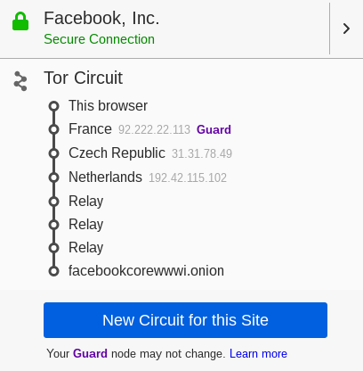

# TP - 25/Fev/2019

## 1-TOR (The Onion Router)

### Pergunta 1.1
Não é possível garantir que estamos localizados nos Estados Unidos (EUA), porque este comando não permite especificar os _ORs_ utilizados no protocolo *TOR*, este processo é feito de forma aleatória. 
No entanto, o protocolo permite que isso aconteça se implementarmos uma aplicação que escolha, de entre os _ORs_ registados no _Directory Server_, um servidor que se encontre nos Estados Unidos como último _OR_.

### Pergunta 1.2
* Circuito de acesso ao site: https://www.facebookcorewwwi.onion/.

Para aceder ao serviço anónimo, o utilizador do serviço começa por aceder ao _Directory Server_ para extrair informação sobre os _Introduction Points_ (IP) e a chave pública do serviço anónimo XYZ.onion. De seguida, cria um circuito _TOR_ até um _Rendez-Vouz_ point (_RP_), para conexão com o serviço anónimo, fornecendo-lhe um _rendez-vouz cookie_, i.e. um segredo aleatório único para posterior reconhecimento do XYZ.onion). 
O utilizador do serviço abre uma stream até um dos _IP's_ do serviço anónimo a quem envia uma mensagem, cifrada com a chave pública do serviço anónimo, com a informação sobre o _RP_, o _rendez-vouz cookie_ e a sua parte da chave de sessão Diffie-Hellman. O serviço anónimo, para responder ao utilizador, constrói um circuito _TOR_ até ao _RP_ do utilizador, enviando uma mensagem com o _rendez-vouz cookie_, a sua parte da chave Diffie-Hellman e o Hash da chave partilhada. 
Assim, existe entre o utilizador e o serviço anónimo um circuito de 6 _OR's_ onde cada uma das partes tem apenas conhecimento de metade do circuito. Desta forma, o utilizador do serviço anónimo tem conhecimento dos 3 _OR's_ até ao _RP_, mas a partir daí os saltos são _rellay_ porque o utilizador não tem conhecimento dos mesmos, e como o circuito _TOR_ do _RP_ até ao serviço anónimo é de 3 _OR's_ existem assim 3 saltos _rellay_.

