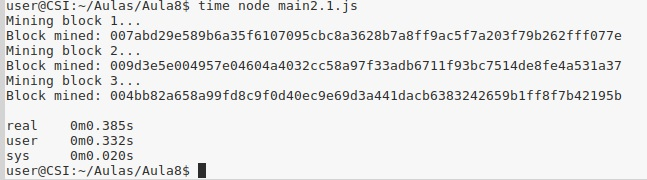
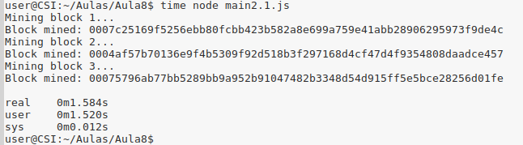
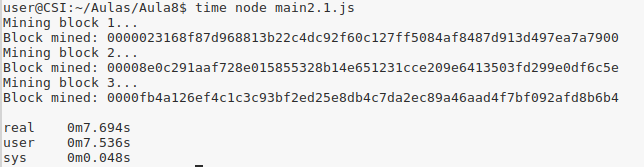
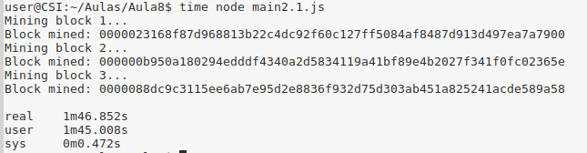

# TP - 25/Mar/2019

## 1-Blockchain

### Pergunta 1.1
No código foi alterado o método que cria o Genesis Block, de modo a que o timestamp seja a data do dia de hoje e o dado incluído nesse Bloco seja "Bloco inicial da koreCoin". Este código encontra-se no ficheiro 'main1.1.js'.

### Pergunta 1.2
A adição de alguns blocos, simulando várias transações em cada um deles, encontra-se no mesmo ficheiro mencionado na pergunta anterior. 

## 2-Proof of Work Consensus Model

### Pergunta 2.1

O mecanismo Proof of Work utilizado na experiência anterior, consiste na resolução de um puzzle em que se pretende encontrar um valor de hash que comece com um determinado números de 0’s. Esta quantidade de 0’s que são necessários encontrar são a dificuldade de resolução do puzzle, sendo que a resolução do puzzle atual não afeta a probabilidade de resolver os puzzles futuros.

Assim, analisando os resultados obtidos, concluimos que quando se aumenta a dificuldade de *mining*, i.e. aumentar o número de 0’s da hash, o tempo para a resolução do puzzle também aumenta.

### Pergunta 2.2

1. Nesta experiência, o algoritmo de 'proof of work' usado é feito da seguinte forma: dado o valor da resolução do último puzzle, este valor é incrementado até que seja obtido um resultado que seja múltiplo de 9 e desse valor, simultaneamente. Quando é encontrado esse resultado, então retornamos esse resultado como prova do nosso trabalho(proof of work).
 
2. Este algoritmo não parece adequado para minerar, pois não é possível definir o grau de dificuldade da resolução do puzzle. Para além disso, também a resolução de um determinado puzzle depende resolução do puzzle anterior.

